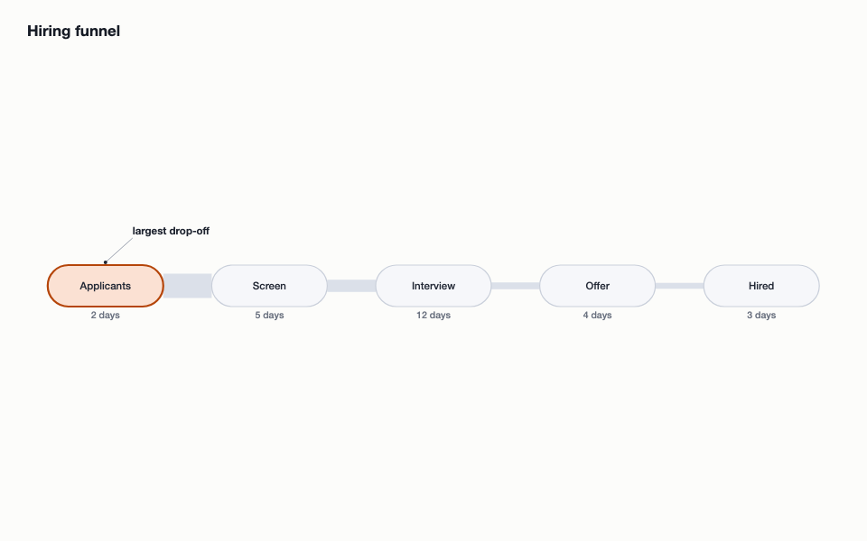
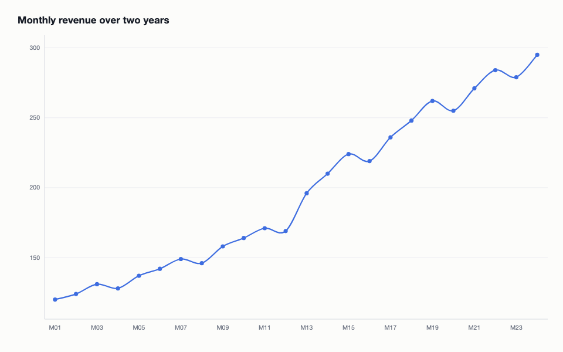
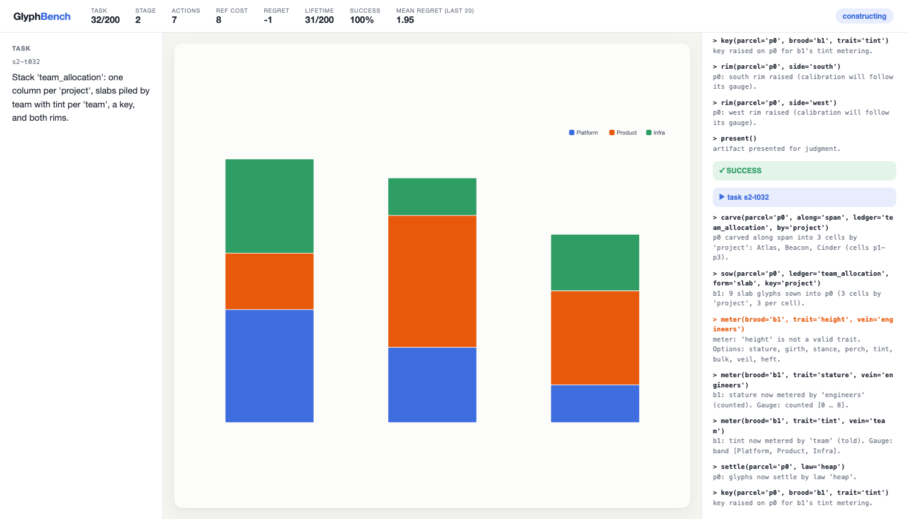

# GlyphBench

**A lifelong tool-learning benchmark.** An LLM agent is handed one strange,
powerful visualization instrument — **VELD** — and lives with it for 200
tasks. Nothing resets between tasks. The scientific question:

> If an agent interacts with the same complicated tool for its entire
> lifetime, does it gradually become an expert?

Visualization is the medium because humans can *see* the agent getting
closer, outputs are beautiful, the tool is deeply compositional, and
correctness is verified structurally — never from pixels.

| | |
|---|---|
|  |  |
|  |  |
|  |  |

## The instrument (VELD)

VELD is deliberately novel — not renamed matplotlib. Space is **carved** into
recursive **parcels**; data ledgers are **sown** into **broods** of glyphs;
values are **metered** into traits (stature, girth, stance, perch, tint,
bulk) through auto-calibrated **gauges**; arrangement emerges from per-parcel
**settle laws** (abreast, heap, strew, wheel, current); relationships are
**cords**, **strands**, and **pipes**; emphasis is **kindling** and
**hushing**. A grouped bar chart is *carve → sow → meter*; a line chart is
*sow → meter stances/perches → strew → thread*; a donut is *hoop → sow →
meter girth*. Knowing D3 or ggplot does not hand you the decomposition
(see `docs/sdk-design.md` — developers only, never the agent).

The agent starts with only a **bootstrap**: `families()`, `ops(family)`,
`sig(op)`, `forms()`, `shelf()`, `peek()`, `veins()`, `census()`,
`study(ref)`, `trace()`, `undo()`, `restart()`, `present()`. Everything else
— all ~120 primitives across 14 families — must be discovered through weak
signatures, constraint-revealing errors, and textual observations.
Everything needed to solve tasks is available textually; rendered SVG is for
humans.

```
agent> carve(parcel='p0', along='span', ledger='quarterly_revenue', by='revenue')
  carve: 'by' must be a told or ranked vein; 'revenue' is counted.
agent> carve(parcel='p0', along='span', ledger='quarterly_revenue', by='quarter')
  p0 carved along span into 4 cells by 'quarter': Q1, Q2, Q3, Q4 (cells p1–p4).
```

Run the full discovery transcript: `python3 scripts/discovery_demo.py`.

## Quick start

No dependencies beyond Python 3.9+.

```bash
# watch a simulated learner master the instrument (opens a live viewer)
python3 run_benchmark.py --agent demo --serve --pace 0.35 --open

# headless full lifetime with logging, then the learning-curve report
python3 run_benchmark.py --agent demo --pace 0 --run-dir runs/demo
python3 scripts/report.py runs/demo

# drive VELD yourself (or from an external LLM agent) over HTTP
python3 run_benchmark.py --agent none --serve
curl -s -X POST localhost:8321/api/act \
  -d '{"op":"sow","args":{"parcel":"p0","ledger":"energy_mix","form":"slab"}}'

# regenerate + revalidate the curriculum, run tests
python3 -m taskgen.build_curriculum
python3 scripts/validate_curriculum.py
python3 -m unittest discover tests
```



The viewer shows the task instruction (left), the live animated artifact
(center), the agent⇄VELD transcript (right), and lifetime stats — task,
stage, actions vs. reference cost, regret, rolling success — on top. Every
scene change tweens smoothly (bars grow, wedges morph, nodes glide).

## Architecture

```
agent op calls ──▶ semantic scene ──▶ layout engine ──▶ display list ──▶ SVG
   (sdk.py)         (scene.py)         (layout.py)        (stable ids)   (+viewer tweens)
                        │
                        └──▶ verifier (verify.py) — reads the scene, never pixels
```

- `glyphbench/sdk.py` — 63 ops, dispatcher, instructive errors, undo
- `glyphbench/scene.py` — canonical semantic representation
- `glyphbench/gauges.py` — deterministic scale resolution
- `glyphbench/layout.py` / `render.py` — deterministic layout → SVG
- `glyphbench/observe.py` — `census()` / `study()` textual views
- `glyphbench/verify.py` — check-based semantic scoring (~85% weight) +
  presentation scoring (overlaps, bounds, crossings; multiple layouts valid)
- `glyphbench/session.py` — lifetime state, logging, regret, exposures
- `glyphbench/curriculum/curriculum.json` — the 200 tasks
- `taskgen/` — curriculum authoring (build to regenerate; extendable to
  unlimited programmatic tasks)
- `viewer/` + `glyphbench/server.py` — the human-facing benchmark viewer
- `agents/` — scripted demo learner + random baseline

## Curriculum (200 tasks, explicitly staged)

| stage | tasks | character |
|---|---|---|
| 1 | 1–25 | primitive discovery: one new concept at a time |
| 2 | 26–60 | short compositions (grouped bars, pies, flows, timelines) |
| 3 | 61–110 | medium: corrals, multi-series, split panels, derived data |
| 4 | 111–160 | advanced: dual gauges, nesting, two-level carves, dashboards |
| 5 | 161–200 | mastery + **plasticity probes** (`pipe` first appears at 163) |

Structured for measurement: **reuse** (repeated primitives get cheaper),
**composition** (primitives learned separately meet for the first time),
**retention** (long-gap reintroductions), **plasticity** (genuinely new
primitives late in life), and rising **composition depth** (2 → 28 concepts
per task). Every task carries a hidden goal, a validated reference program
(all 200 verify green), required/new concepts, and difficulty metadata the
agent never sees.

## Verification & metrics

`present()` submits the scene. Success requires all semantic checks (data
content is compared as row multisets, so *any* correct derivation path
passes; alternate orientations/layouts pass; visually-similar-but-wrong
scenes fail with named reasons) plus a presentation score ≥ 0.7. Per task,
the logs record success, semantic/layout scores, total/failed/introspection/
undo actions, and **reference regret** `R = C_agent − C_ref`. Lifetime
traces (`runs/*/actions.jsonl`, `tasks.jsonl`, `exposures.json`) support the
plots the benchmark exists for: task number vs. success, regret, discovery
cost, and composition depth. `scripts/report.py` prints them as windowed
tables; the demo agent shows the intended arc (mean regret 3.65 → 0.15).

## What this prototype demonstrates (milestones)

1. Novel, coherent SDK design (`docs/sdk-design.md`)
2. Semantic scene + renderer producing presentation-ready output by default
3. Textual discovery loop (`scripts/discovery_demo.py`)
4. Verifier accepting alternate constructions, rejecting look-alikes
   (`scripts/verify_demo.py`)
5–7. Full 200-task validated curriculum
8. Animated viewer + lifetime instrumentation
