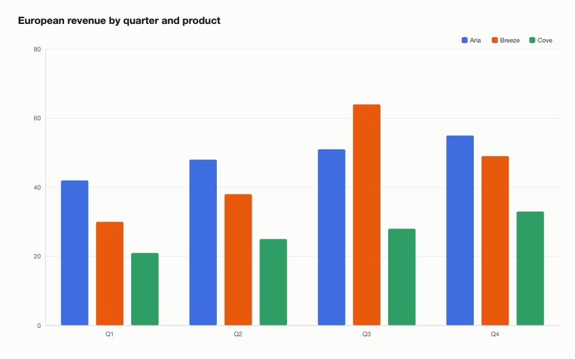
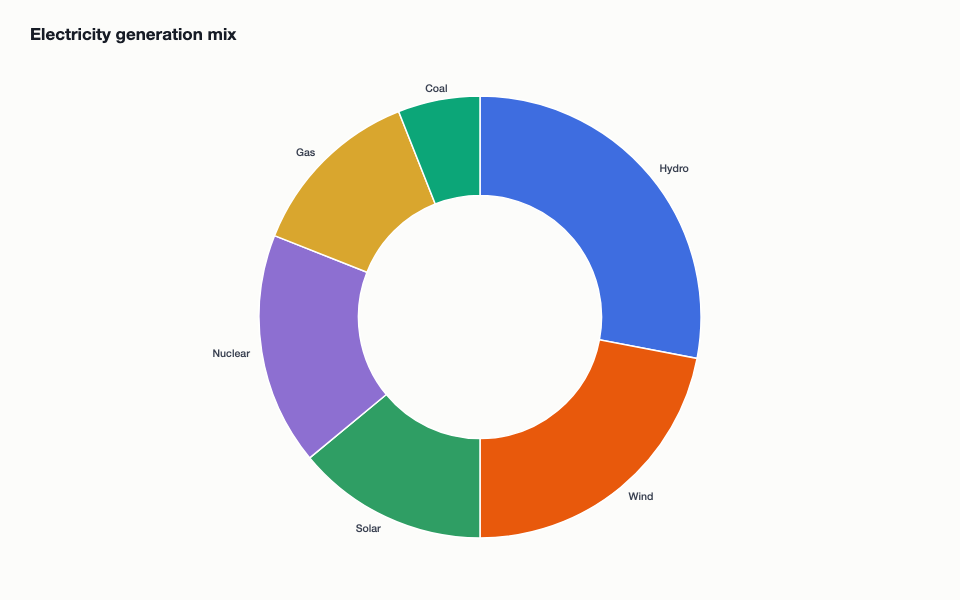
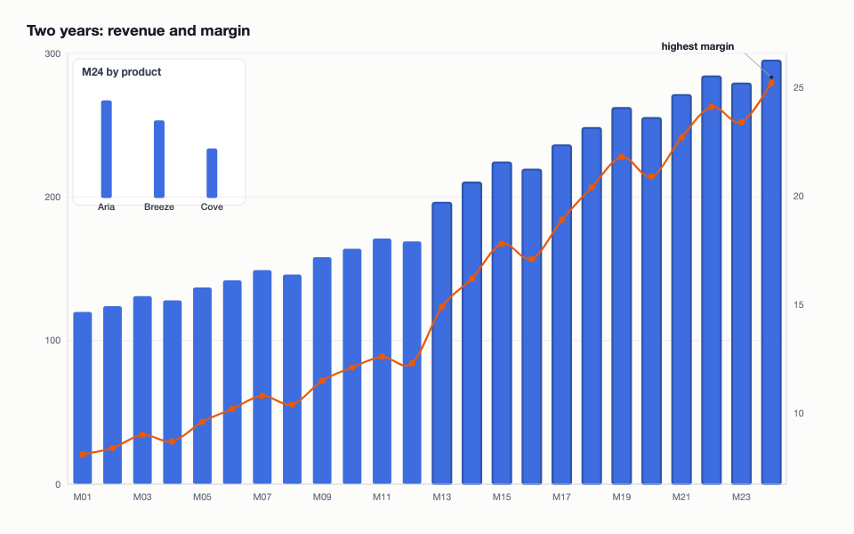
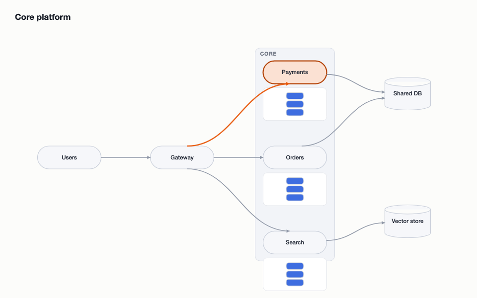

# DiagramBench

**A lifelong tool-learning benchmark.** An LLM agent must master **SIGIL** — a
deliberately unfamiliar, compiled language for constructing charts and
diagrams — across **200 levels that unlock strictly in order**. Nothing resets between levels. The core question:

> If an agent has to discover how to use the same complicated software from scratch and use it over a long horizon, does it gradually become an expert?

The diagrams the agent produces are visually inspectable, the skills have to be discovered and then remembered, reused and composed, and correctness is verified structurally.


| | |
|---|---|
|  |  |
|  |  |


## The benchmark, in one loop

One rollout is one *lifetime*. Each level is a small **multi-file project** in
its own sandboxed folder — task inputs ship as data files, and the agent works
like an engineer: read the brief, inspect the data, write code, compile, run,
**study the render**, iterate, submit.

```
levels/L026/
├── BRIEF.md            the instruction (the only task statement)
├── sigil.toml          project manifest
├── data/*.tsv          inputs — schemas must be declared to load them
├── src/*.sgl           the agent's SIGIL units
└── out/render.txt      the ASCII render of the last run

./sigil status | grammar | build | run | present | explain F231
```

**Budgets: 40 toolchain invocations and 3 presents per level — exhausting
either ends the entire run.** With presents that scarce, the agent's own
render is its primary feedback: every `./sigil run` rasterizes the artifact to
a 160×60 ASCII view (image mode writes `render.png` for multimodal harnesses).

### SIGIL

SIGIL (Staged Instruction Grammar for Illustrated Layouts) borrows its
worldview from C, CUDA, and array languages rather than any plotting library.
Files are **aspect-locked translation units** (`unit data|ground|marks|script| compose;`), broods follow an alloc → route → commit lifecycle, traits bind
inside per-glyph kernels through declared **gauges** that must be calibrated,
and nothing renders without exactly one `settle!;`. Faults are C-style and
terse; `./sigil explain F244` exists but costs budget.

```
unit marks;

brood bars = alloc brood(eu);
route bars into @root by .quarter;
commit bars;

gauge gy = gauge counted;
gauge gc = gauge banded(eu.product);
over bars as g {
  g.form    = slab;
  g.stature = gy(.revenue);
  g.tint    = gc(.product);
  if (.quarter == "Q3" && .product == "Breeze") { kindle g; flag g "Peak quarter"; }
}
calibrate gy, floor 0;
```

A run always answers with the artifact:

```
 80 │                        ▓▓▓▓
    │              ▓▓        ████▓▓        ██ ▓▓
 40 │  ██ ▓▓ ▒▒    ██ ▓▓ ▒▒  ████▓▓ ▒▒     ██ ▓▓ ▒▒
  0 └────Q1──────────Q2────────Q3────────────Q4────
 fills: █=#3E6DE0  ▓=#E8590C  ▒=#2F9E64   ◉=kindled
```


### Curriculum (200 levels, explicitly staged)


| stage | levels  | character                                                  |
| ----- | ------- | ---------------------------------------------------------- |
| 1     | 1–25    | primitive discovery — one concept at a time                |
| 2     | 26–60   | short compositions (grouped bars, rings, flows, timelines) |
| 3     | 61–110  | medium: corrals, multi-series, split panels, derived data  |
| 4     | 111–160 | advanced: dual gauges, nested arenas, two-level cleaves    |
| 5     | 161–200 | mastery + plasticity probes (`pipe` first appears at 163)  |


Structured to measure **reuse**, **composition**, **retention** (long-gap
reintroductions), **plasticity** (new primitives late in life), and rising
composition depth (2 → 28 concepts per level).

### Verification & scoring

Each level carries a hidden semantic goal checked against the constructed
scene, never pixels; alternate valid layouts pass, look-alikes fail with named
reasons. Scoring is **tamper-proof by construction**: every `build` logs the
full source tree, and the host replays the log against the true hidden goals —
the sandbox is never trusted, and reference solutions never enter it.

- reward: `progress` (levels cleared / gauntlet length)
- metrics: `levels_completed`, `toolchain_calls`, `failed_builds`,
`runtime_traps`, `presents_used`, `mean_regret_stmts` (final program size
beyond the hidden reference program), `run_terminated`


## Running it

DiagramBench ships as a native **verifiers v1** environment
(`environments/diagrambench-v1`, package id `diagrambench-v1`) runnable with
the Prime CLI on any bash-capable harness — no MCP needed:

```bash
prime eval validate diagrambench-v1                       # gold replay (all levels)
prime eval run diagrambench-v1 --taskset.num-levels 10 \
  --harness.id codex --harness.runtime.type prime -m deepseek/deepseek-v4-flash
```

Config: `--taskset.start-level N` and `--taskset.num-levels K` slice the
lifetime; a reproducible run config lives at
`configs/eval/diagrambench-codex.toml`.

### Watching a run live

```bash
python3 scripts/sandbox_viewer.py outputs/<run-dir>   # finds the sandbox id
python3 scripts/sandbox_viewer.py <sandbox-id>        # or attach directly
```

Serves a local dashboard (default `:8399`) that polls the sandbox and replays
its build log through the real engine: level/budget status, the agent's
source tree as it's written (with unbuilt-changes badges), the toolchain
trajectory (builds, faults, traps, presents), and the rendered artifact after
every run — SVG or ASCII, scrubbable back through time.

Reference result (levels 1–10, deepseek-v4-flash, codex harness, prime
sandbox): **reward 1.00** — 46 toolchain calls, 6 failed builds, 2 runtime
traps, 11 presents, mean regret +6.5 statements, ~45K trajectory tokens in
18 minutes. The intended learning curve is visible even here: level 1 took
6 calls and a failed build to place a single slab; levels 7–10 were solved
write → build → run → present on the first try.

## Repo layout

- `environments/diagrambench-v1/` — **the benchmark**: verifiers taskset,
SIGIL compiler (`core/sigil_lang.py`, `core/sigil_lower.py`), executor,
ASCII rasterizer, project engine + budgets, in-sandbox `./sigil` CLI,
reference transpiler, vendored scene engine, `curriculum.json`
- `diagrambench/` — the underlying scene engine (semantic scene, gauges,
deterministic layout, SVG renderer, verifier) plus the original op-level
interface and lifetime session
- `taskgen/` — curriculum authoring; `python3 -m taskgen.build_curriculum`
regenerates, `scripts/validate_curriculum.py` (op level) and
`scripts/validate_sigil.py` (SIGIL level) must both go green
- `viewer/` + `run_benchmark.py` — local animated demo viewer (op interface)
- `docs/sdk-design.md` — internal design doc for the scene ontology
(developers only; agents never see it)
- `scripts/` — validation, demos, harness comparison, lifetime reports

